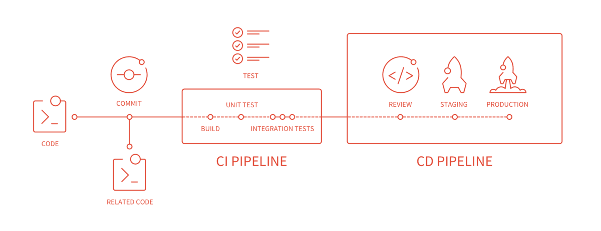

# CI/CD conception

# Installing GitLab using the Omnibus GitLab package (recommended)
The Omnibus GitLab package uses our official deb/rpm repositories. This is recommended for most users.
If you need additional flexibility and resilience, we recommend deploying GitLab as described in our [High Availability documentation](https://docs.gitlab.com/ee/administration/high_availability/README.html).

# Installing GitLab with Docker
GitLab maintains a set of official Docker images based on the Omnibus GitLab package.
> Install GitLab using the official GitLab Docker images.

# Reference
[Gitlab CI/CD kubernetes](https://www.jianshu.com/p/73cdfbacd5b6)

[gitlab doc](https://docs.gitlab.com/ee/install/README.html)